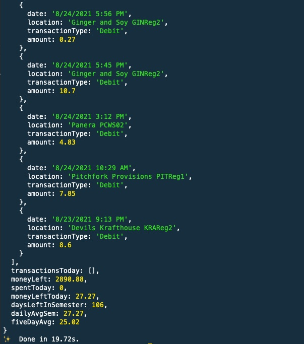

# Duke Food Point Tracker

1. Create a file `config.json` in this directory with the following format:

```json
{
    "username": "<netid>",
    "password": "<password>"
}
```

2. Run `npm i` to install dependencies.

3. Run `npm start` to print out results.

Results should look something like this:

